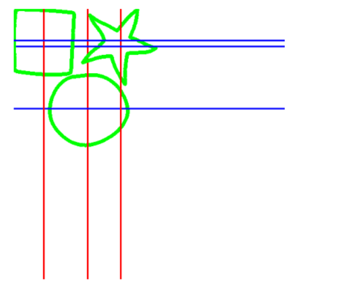
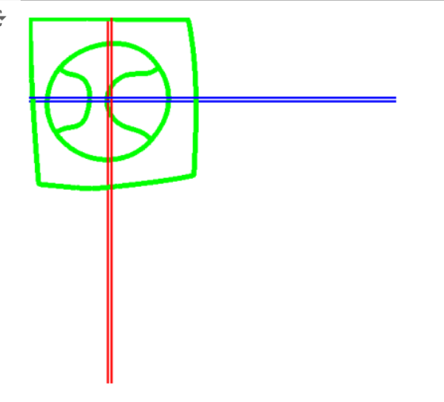
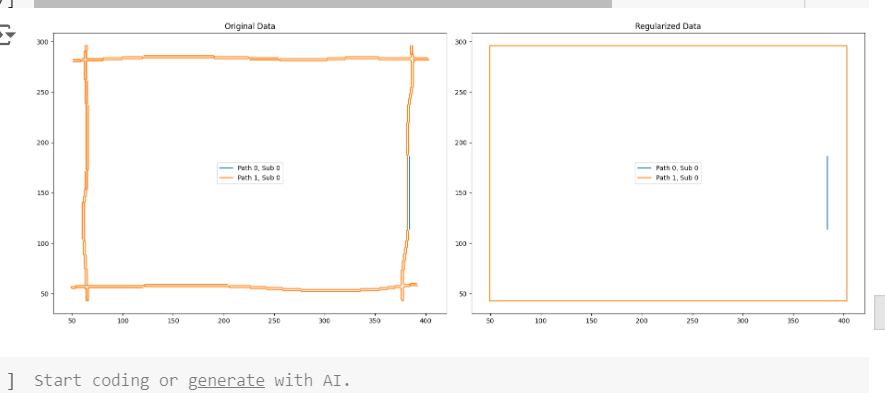
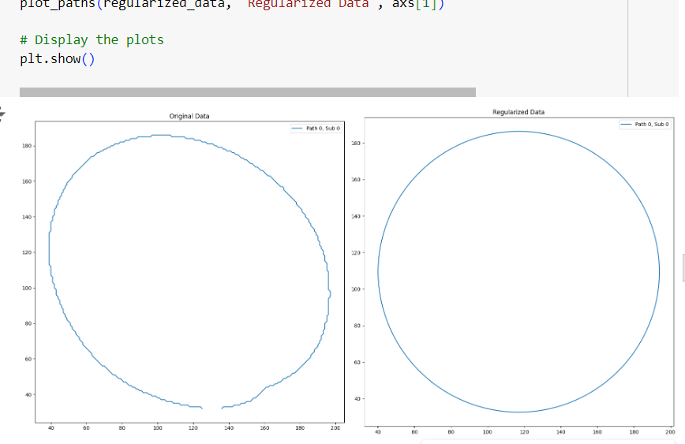
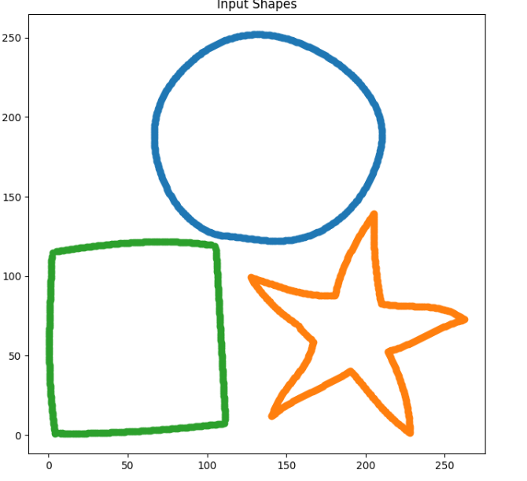
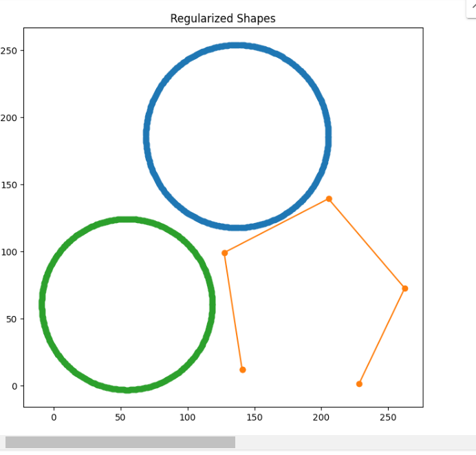
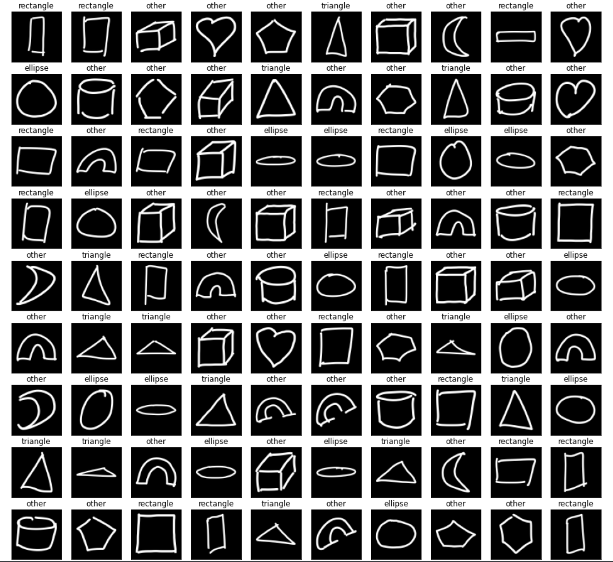

# CURVETOPIA

CURVETOPIA is a project focused on analyzing and regularizing hand-drawn shapes. It has three main features:

## Features

1. **Detecting Symmetry in Hand-Drawn Shapes**
   - This feature detects symmetry in hand-drawn shapes.The code written processes a CSV file containing hand-drawn shape data, clusters the points into distinct 
     shapes, detects symmetry lines for each shape, and visualizes the results.
   - It initially reads shape points from a CSV file and convert them into a NumPy array and then groups points into clusters to identify separate shapes using 
     DBSCAN (Density-Based Spatial Clustering of Applications with Noise)
   - Determined the symmetry lines of a shape based on its point coordinates and used matplotlib to show the final image with shapes and symmetry lines.  
   - Here are the example images for this feature:
      Symmetry detected in rectangle,circle and star.
      Symmetry detected in square and circle.
     

2. **Regularizing Hand-Drawn Shapes**
   - This feature regularizes hand-drawn shapes, transforming them into more standardized forms.
   - We have written a algorithm to regularise hand drawn shapes.This code processes a CSV file containing hand-drawn shape data, regularizes these shapes into 
     standard geometric forms
   - We used Density-Based Spatial Clustering of Applications with Noise (DBSCAN) to identify connected components in the data based on proximity.
   - We further used the convex hull to outline the polygons and regularized it based on the number of sides.
   - Processed each detected shape, applied regularization, and saved the results.
   - Finally,we used matplotlib to display the shapes before and after regularization for comparison.
   - Here are the example images for this feature:
     
     
     
     

3. **Detecting Hand-Drawn Shapes Using CAN**
   - This feature detects shapes in hand-drawn images using a CNN (Convolutional Neural Network).
   - Code written implements a Convolutional Neural Network (CNN) to classify hand-drawn shapes into categories such as ellipse, rectangle, triangle, and other.
   - It begins by importing necessary libraries for image processing and machine learning, then prepares the data by loading and normalizing images from a dataset.
   - The images are split into training, validation, and test sets.
   - A CNN model is defined with several convolutional layers to extract features, pooling layers to reduce dimensionality, and dense layers to make final 
     predictions.
   - Finally, the training and validation losses and accuracies are plotted to visualize the model's performance over time.
   - Here is the example image for this feature:
     
